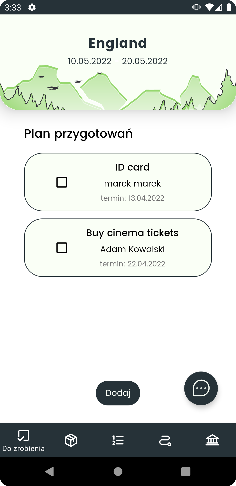

# Android Travel Planner Application
Extensive application which helps to plan grooup trips created for Android devices. 
The app offers functions such as chat, forum, gallery, trip plan, to do list and settlements.

## Table of Contents
* [General Info](#general-information)
* [Technologies Used](#technologies-used)
* [Features](#features)
* [Screenshots](#screenshots)
* [Setup](#setup)
* [Project Status](#project-status)
* [Room for Improvement](#room-for-improvement)
* [Contact](#contact)

## General Information
The project was developed in a group of four people as an university project aimed at solving a problem of effective trip planning. 
The authors created an app that connects trip participants and helps in organiziation.
The app allows the travellers to contact with each other, make a plan of a trip plan as well as to do list and split respontibiities between participants. 
What is more, the users can record their expenses what helps to settle the costs. 
An addicional advantage of the app is photo gallery, where the users can post pictures from the trip. 

## Technologies Used
- Material Design 1.3.0
- Kotlin 1.5.0
- Firebase Messaging Service 20.0.0
- Google Maps Services 18.0.0
- Navigation Graph
- ViewBinding
- MySQL database with JDBC 5.1.49

## Features
List the ready features here:
* chat and forum
* photo gallery
* making a plan of a trip 
* maps with a trip route
* TO-DO list and TO-TAKE list
* financial settlements
* adding expenses to the list of settlements
* inviting new users to a trip 
* creating an account
* notifications
* sharing the location with other participants 
 

## Screenshots
Application screen presentation
### Application main screen

	

### Overview of application screens

	
	
	
	
	
	

## Setup
1. Download the samples by cloning this repository
2. In the welcome screen of Android Studio, select "Open an Existing project"
3. Select one of the sample directories from this repository

Alternatively, use the `gradlew build` command to build the project directly
 
It is nesessary to connect the project with database and Google Maps services to fully use the Android Travel Planner Aplicaton. 
So that the app could use the database in a file [BaseConnection.java](./ZPI/app/src/main/java/com/example/zpi/data_handling/BaseConnection.java), _connection URL_,
_username_ and _password_ of the data base have to be set. The next step is to create an account on Google Cloud Platform 
following the instruction here: [cloud.google.com](https://cloud.google.com/apigee/docs/hybrid/v1.3/precog-gcpaccount) and create a project. 
In the project proper interfaces should be found and activated API _Directions API_, _Maps SDK for Android_ and _Places API_. When the interfaces are activated, 
in project files [strings.xml](./ZPI/app/src/main/res/values/strings.xml) individually generated API key should be set.

## Database
Hosting on: https://www.db4free.net/  
Server: db4free.net  
DB Name: zpi_test_db  
Username: zpi_test_user  
Password: zpi_test_password  
Port number: 3306    

Saving in database will be done using DAO, which are found in repositories file.

## Project Status
Project is: _complete_

## Room for Improvement
To do:
* adding expenses categories and on their bases creating charts
* supporiting devices without the location function

Improvement:
* trip participants management

## Contact
Created by [@HKonstanty](https://github.com/HKonstanty/HKonstanty) - feel free to contact me!